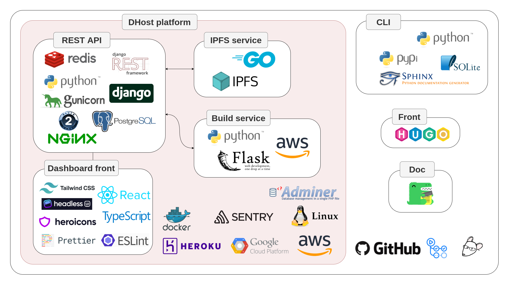

# DHost



## Setup

For a complete setup guide go to [docs/setup.md](./docs/setup.md) or use Docker [tools/docker/README.md](./tools/docker/README.md).

<<<<<<< HEAD
<<<<<<< HEAD
```ssh
cd tools/docker
```

To start the project.

```shell
docker-compose up -d --build
```

Apply migrations.

```shell
docker-compose run --rm api python manage.py migrate
```

Load fixture (demo data).

```shell
docker-compose run --rm api python manage.py loaddata dhost/demo/fixture.json
```

Collect static files.

```shell
docker-compose run --rm api python manage.py collectstatic
```

Visit the site: [http://localhost:8000/](http://localhost:8000/).
=======
To start the project.

```shell
docker-compose up -d --build
```

Apply migrations.

```shell
docker-compose run --rm api python manage.py migrate
```

Load fixture (demo data).
>>>>>>> d13dd1a (ipfs docker)

```shell
=======
To start the project.

```shell
docker-compose up -d --build
```

Apply migrations.

```shell
docker-compose run --rm api python manage.py migrate
```

Load fixture (demo data).

```shell
>>>>>>> aa01e7be49802c2e59f915b7fbf62070fb91cfcd
docker-compose run --rm api python manage.py loaddata demo
```

Collect static files.

```shell
docker-compose run --rm api python manage.py collectstatic
```

Verify.

```shell
docker-compose ps
```

When you want to stop it.

```shell
docker-compose down
```

Visit:

* [Dahsboard](http://localhost:3000/) on port: `3000`
* [API and OAuth server](http://localhost:8000/api/) on port: `8000`
* [IPFS web UI](http://localhost:5001/webui) on port `5001`
* [Grafana](http://localhost:3030/) on port: `3030`
* [Prometheus](http://localhost:9090/) on port: `9090`
* [Task Monitor (Flower)](http://localhost:5555/) on port: `5555`
* [Mail interface (Mailhog)](http://localhost:8025/) on port: `8025`
* [DB explorer (Adminer)](http://localhost:8080/) on port: `8080`
* Database (PostgreSQL) on port: `5432`
* Message Broker (Redis) on port: `6379`

You can also use the CLI to communicate with the API.

## Contributing

To start contributing please refer to the [CONTRIBUTING.md](./CONTRIBUTING.md) doc.

## License

The project is licensed under the [MIT License](./LICENSE).
